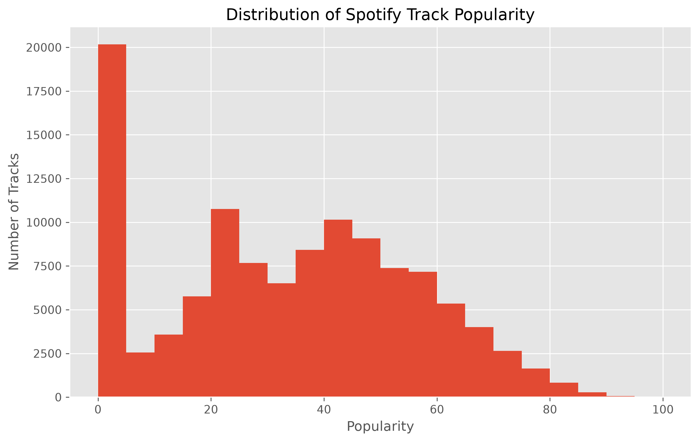
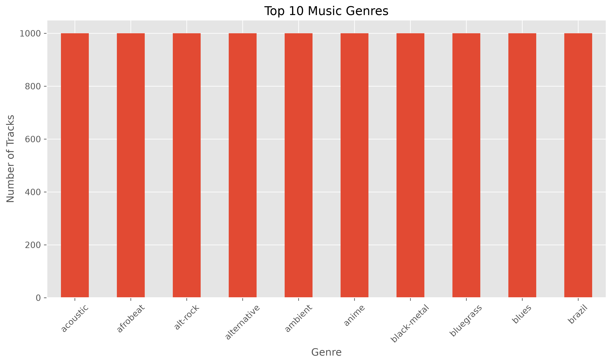
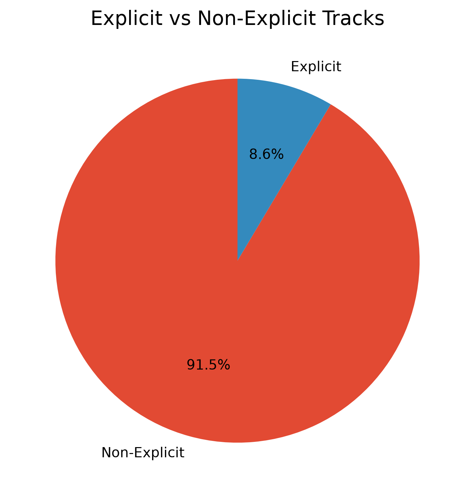
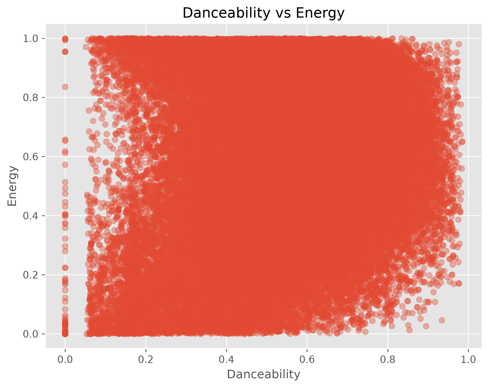
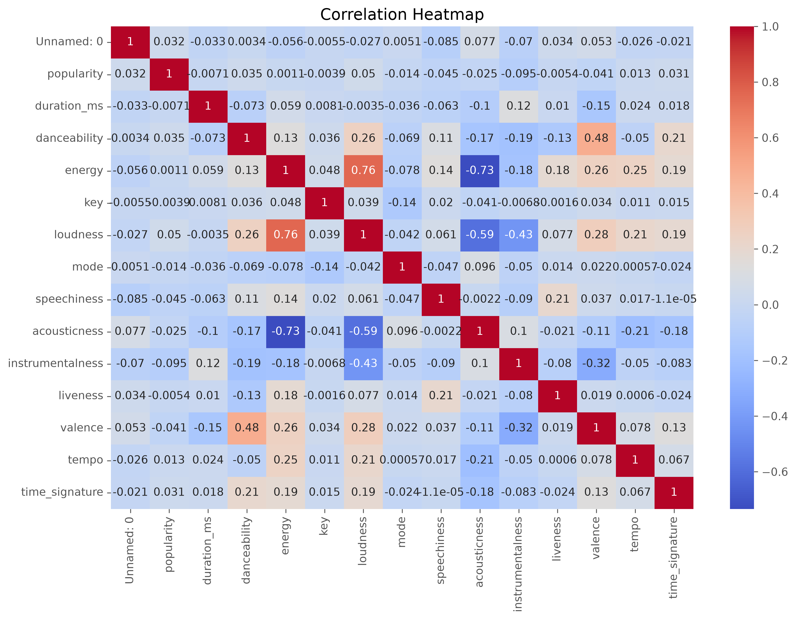
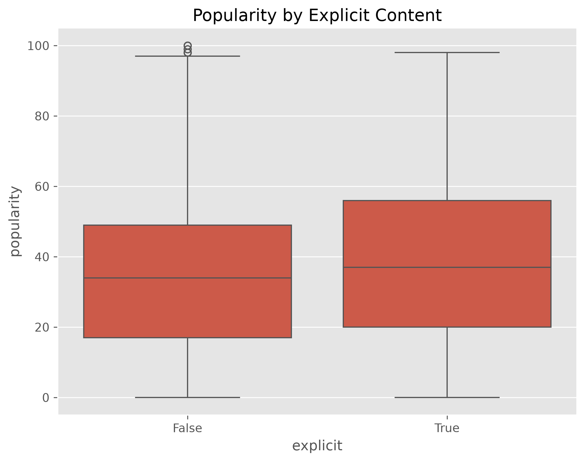

# Spotify Tracks Dataset - Exploratory Data Analysis & Data Visualization

## 📌 Project Overview

This project explores the Spotify Tracks Dataset using Exploratory Data Analysis (EDA) and data visualization techniques. The objective is to understand the dataset, identify relationships between musical attributes, and communicate meaningful insights through effective visual storytelling using Matplotlib and Seaborn.

---

# 📂 Dataset Overview

The dataset contains information about Spotify tracks, including:

* Track Name
* Artist
* Album
* Popularity
* Danceability
* Energy
* Loudness
* Tempo
* Acousticness
* Instrumentalness
* Speechiness
* Valence
* Liveness
* Explicit Content
* Music Genre

These features help analyze musical characteristics and listening trends across different tracks and genres.

---

# 📈 Visualizations

## 1. Distribution of Track Popularity



**Insight:** Most tracks have moderate popularity, while only a small percentage achieve very high popularity.

---

## 2. Top 10 Music Genres



**Insight:** A limited number of genres contribute the majority of tracks in the dataset.

---

## 3. Explicit vs Non-Explicit Tracks



**Insight:** Non-explicit tracks significantly outnumber explicit tracks.

---

## 4. Danceability vs Energy



**Insight:** Songs with higher danceability generally tend to exhibit higher energy, although exceptions exist.

---

## 5. Correlation Heatmap



**Insight:** Audio features show varying levels of correlation, indicating that multiple characteristics influence musical style.

---

## 6. Popularity by Explicit Content



**Insight:** Explicit content alone does not appear to have a strong influence on track popularity.

---

# 💡 Overall Findings

* The dataset contains a wide variety of musical genres and audio characteristics.
* Track popularity is influenced by multiple audio features rather than a single factor.
* Danceability and energy exhibit a positive relationship.
* Most songs are non-explicit.
* Correlation analysis helps identify relationships among audio features that may be useful for recommendation systems.

---

# 🛠️ Technologies Used

* Python
* Pandas
* NumPy
* Matplotlib
* Seaborn
* Jupyter Notebook

---

# 📁 Repository Structure

```text
epochs26-day04-data-visualization/
│
├── visualization.ipynb
├── dataset.csv
├── README.md
└── images/
    ├── visualization1.png
    ├── visualization2.png
    ├── visualization3.png
    ├── visualization4.png
    ├── visualization5.png
    └── visualization6.png
```

---

# 📌 Conclusion

This project demonstrates how exploratory data analysis and visualization can transform raw data into meaningful insights. By combining statistical analysis with visual storytelling, the Spotify Tracks dataset reveals trends in popularity, genres, and audio characteristics that can support future music recommendation and analytics applications.
